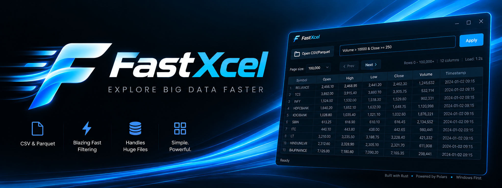

# FastXcel

<p align="center">
  
</p>

FastXcel is a Windows-first desktop viewer for large CSV and Parquet datasets. It is built with Rust, Polars, and egui to keep huge tabular files usable without loading them into a spreadsheet.

[](https://github.com/FinRizz/FastXcel/actions/workflows/ci.yml)
[](LICENSE)
[](https://www.rust-lang.org)
[](#download)

## Download

- [](https://github.com/FinRizz/FastXcel/raw/main/release/fastxcel.exe)
- [Download the Windows binary](https://github.com/FinRizz/FastXcel/raw/main/release/fastxcel.exe)
- [View all releases](https://github.com/FinRizz/FastXcel/releases)

The download link points to the checked-in Windows binary at `release/fastxcel.exe`. If you prefer, you can still build from source using the instructions below.

## Why FastXcel

Opening a multi-gigabyte dataset in a spreadsheet is a bad time. Excel caps out at about 1 million rows, pandas wants the whole file in RAM, and both freeze the moment you scroll. FastXcel is built for the specific job of inspecting large tabular data from any schema:

| Problem | FastXcel's approach |
| --- | --- |
| Row limits in spreadsheet tools | Paged reads - you choose the window, not the tool |
| Whole-file loads into memory | Polars `LazyFrame` plus `.slice()` per page |
| Different file schemas | Works directly with the columns present in the file |
| UI stalls on large data | egui virtualized table - only visible rows are drawn |
| Slow ad-hoc filtering | Filters compile to Polars expressions, pushed into the scan |

## Features

- CSV and Parquet input, chosen through a native Windows file picker
- Live filtering with a small comparison DSL, for example `Open > 100 & Volume > 10000`
- Schema-agnostic handling for files with different column layouts
- Paged navigation with a configurable page size from 1,000 to 2,000,000 rows
- Horizontal scrolling for wide tables, so columns do not get squeezed into the viewport
- GPU-backed rendering via `eframe`'s wgpu backend
- Single self-contained executable, with no runtime or interpreter to install

## Installation

### Windows binary

Use the [download link above](#download) to get `fastxcel.exe`.

### Build from source

Requires the [Rust toolchain](https://rustup.rs) version 1.88 or newer.

```powershell
git clone https://github.com/FinRizz/FastXcel
cd FastXcel

cargo build --release --locked
.\scripts\embed-windows-icon.ps1
.\target\release\fastxcel.exe
```

Always build with `--release --locked`. A debug build of Polars is much slower and makes the app feel broken on realistic datasets, and `--locked` keeps the release build reproducible. Run `.\scripts\embed-windows-icon.ps1` after the build to generate `target\release\fastxcel.ico` and embed the Windows icon from `assets/icon.png` into the `.exe`.

To build and launch in one step:

```powershell
cargo run --release --locked
```

For logging:

```powershell
$env:RUST_LOG="debug"; cargo run --release --locked
```

Linux and macOS are not currently tested. The dependency stack is cross-platform, so a source build may work with the usual GTK or Wayland development packages installed.

## Usage

1. Click `Open CSV/Parquet` and pick a file.
2. Use `Prev` and `Next` to page through it.
3. Adjust `Page size` to trade memory and latency against how much you see at once.
4. Type a filter expression and press `Apply`.

The status line reports load time, column count, and the row range currently shown. A trailing `+` means at least one more page exists.

### Filter expressions

The filter box takes a small, deliberately minimal DSL, not full Polars expression syntax.

| Element | Supported |
| --- | --- |
| Comparison | `>` `>=` `<` `<=` `==` `!=` |
| Logical | `&` and `|`, left-associative, with `&` binding tighter |
| Grouping | `( )` |
| Left operand | A column name, using letters, digits, and `_` |
| Right operand | A number, or for `==` and `!=` only, a bare word treated as a string |

```text
Open > 100 & Volume > 10000
(Close >= 250) | (Low < 100)
Symbol == TCS & Volume > 500000
```

Filters use the column names present in the file.

Known limits of the DSL:

- No quoted strings. Write `Symbol == TCS`, not `Symbol == "TCS"`
- No negative numbers, and no `NOT`
- No column-to-column comparison, so `Open > Close` is rejected
- Invalid input fails silently. A filter that does not parse is dropped and every row is shown, so a typo looks like "the filter did nothing"
- Trailing junk after a valid expression is ignored rather than rejected

A filter that parses but is invalid for the data, such as comparing a text column to a number, surfaces as a red `Load error:` line from Polars.

## Current status and limitations

FastXcel is a working MVP at `0.1.0`. Current limitations:

- Opening a file materializes it. The schema is currently derived by collecting the whole frame, so peak memory on open scales with file size rather than page size. Paging after open is lazy.
- The page is re-collected every frame. There is no result cache, so the Polars query runs continuously while the window is open.
- No total row count. Counting rows would require scanning the file, so it is skipped by design. The `+` indicator is a heuristic.
- Paging past the end shows an empty table rather than clamping, and `Prev` at offset 0 is a no-op.
- No sorting, no column pinning, no editing, and no export. This is a viewer.
- CSV parsing assumes a header row, infers types from the first 512 rows, and ignores malformed rows silently.

Performance numbers are intentionally absent until they are reproducible on a published benchmark.

## Architecture

The main flow runs through four modules:

```text
src/
|-- main.rs      # eframe entry point and logger init
|-- app.rs       # all UI state, top bar, and frame loop
|-- data.rs      # LazyFrame ownership, open_path, fetch_page
|-- columns.rs   # alias_map, canonicalization, and the filter DSL parser
`-- ui/table.rs  # virtualized egui table and dtype formatting
```

Every query goes through `DataEngine::fetch_page`, which canonicalizes columns, applies the parsed filter, slices the page, and collects it.

## Roadmap

- Cache collected pages and invalidate on offset, page size, or filter change
- Derive schema without materializing the frame
- Add quoted string literals, negative numbers, and `NOT` in the filter DSL
- Surface parse errors instead of silently dropping the filter
- Add column pinning and click-to-sort
- Add a schema and column statistics panel
- Add a candlestick chart view for OHLCV data
- Add additional formats such as Arrow IPC and JSONL
- Add a benchmark harness with published numbers

## Contributing

Contributions are welcome. Start with `CONTRIBUTING.md` for setup, build commands, and repository conventions.

By participating, you agree to abide by the `CODE_OF_CONDUCT.md`.

To report a security issue, follow `SECURITY.md`. Please do not open a public issue for security reports.

Release history lives in `CHANGELOG.md`.

## License

MIT. See `LICENSE`.

## Acknowledgements

Built on [Polars](https://github.com/pola-rs/polars), [egui / eframe](https://github.com/emilk/egui), and [rfd](https://github.com/PolyMeilex/rfd).
